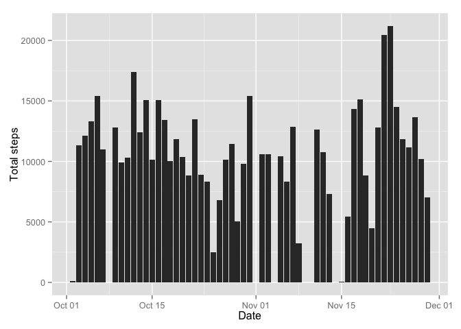
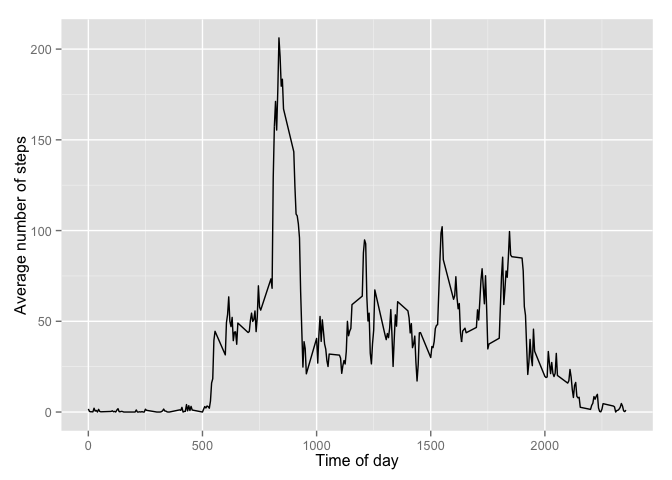
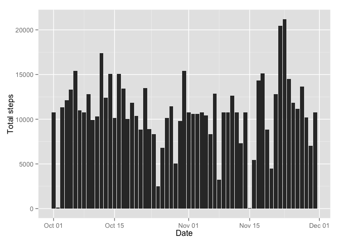
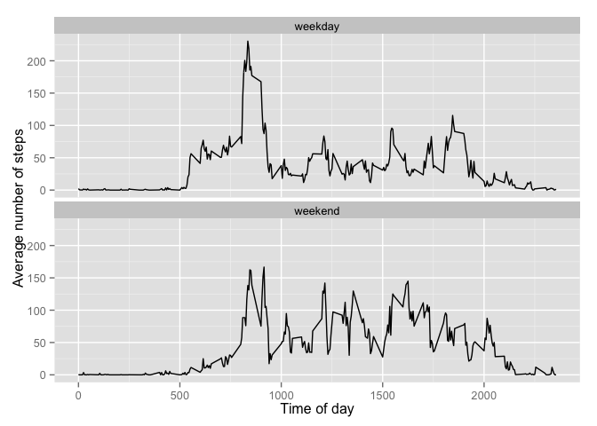

# Reproducible Research: Peer Assessment 1
Marguerite Smith  
3 April 2016  


## Overview

With the increase in the number of personal movement tracking devices like Fitbit, Nike Fuelband, and Jawbone Up, there is an associated increase in the amount of data available for analysis.

As stated on the project description page, this assignment makes use of data from a personal activity monitoring device. This device collects data at 5 minute intervals through out the day. The data consists of two months of data from an anonymous individual collected during the months of October and November, 2012 and include the number of steps taken in 5 minute intervals each day.

Exploratory analysis will be done on this data file in order to examine a number of areas and answer certain questions.

## Loading the data

This markdown file was written with the assumption that the data file has already been downloaded, extracted to CSV format, and stored in the same directory as the markdown file itself. Once those conditions are met, the file data can be read in to a variable with the following R code:


```r
move_data <- read.csv('activity.csv')
```

If you wish to start with online data, you can do the following instead.


```r
# Since we're using GitHub in this example, be sure to get the raw data.
# This currently downloads the ZIP file in binary format to the local directory.
download.file('https://github.com/emargsm/RepData_PeerAssessment1/blob/master/activity.zip?raw=true',"activity.zip",mode="wb")

# Extract the file and then read the CSV file into memory. For simplicity's sake
# we are assuming we already know the name of the file inside the archive.
unzip("activity.zip")
move_data <- read.csv('activity.csv')
```

## Answering questions

### What is the mean total number of steps taken per day?

In this case, NA values can be ignored. However, values of 0 are included.

Tasks for this section:
1. Make a histogram of the total number of steps taken each day.
2. Calculate and report the mean and median total number of steps taken per day.

Start by removing the lines with missing data. Once those lines are omitted, do the following:
1. Make sure that the date fields are recognised as date objects.
2. Aggregate the data per date, using the sum method.
3. Use ggplot2 to create a histogram of the daily totals.
4. Use the `mean()` and `median()` functions to create the appropriate values.
5. Print the informaiton.


```r
step_data <- move_data[ which(move_data$steps != "NA"), ]
step_data$date <- as.Date(step_data$date)

daily_total <- aggregate(step_data$steps,by=list((substr(step_data$date,1,10))),sum) 
daily_mean <- format(round(mean(daily_total$x),2))
daily_median <- format(round(median(daily_total$x),2))

library(ggplot2)
library(scales)
totalhist <- ggplot(data=step_data,aes(x=date,y=steps)) + 
  geom_histogram() + 
  stat_summary(fun.y=sum, geom="bar") +
  xlab("Date") +
  ylab("Total steps")

plot(totalhist)
```

 

```r
# In the text, print daily_mean and daily_median.
```


Taking each daily total of steps, the mean of all totals is roughly `daily_mean:` 10766.19.
Taking the same set of daily totals of steps, the median of these figures is `daily_median:` 10765.

### What is the daily activity pattern?

In this case, we want to subdivide the data per five-minute interval. This is in comparison to the previous question, where we subdivided by date. However, we can use similar methods.

We still remove the 'NA' values, and do similar aggregation as described above. However, this time we plot the data in a time-series graph. Note that the five minute intervals are numeric representations of the 24-hour clock. The figures go from midnight (0000, shortened to 0) to 11.55pm (2355).


```r
# We can reuse the same step_data as created above.
five_min_total <- aggregate(step_data$steps,by=list(step_data$interval),mean) 

library(ggplot2)
library(scales)
fiveplot <- ggplot(data=five_min_total,aes(x=Group.1,y=x)) + 
  geom_line() +
  xlab("Time of day") +
  ylab("Average number of steps")

plot(fiveplot)
```

 

```r
maxfive <- five_min_total[five_min_total$x==max(five_min_total$x),]
maxtime <- maxfive$Group.1
# In the text, print maxtime.
```

The time period with the maximum average number of steps is 835.


### Imputing missing values

The lack of values in certain dates & time periods means that bias could be introduced into some calculations or summaries. With this in mind, it can be beneficial to try to fill in the missing values and recalculate.

With that in mind, these tasks will be done:
1. Calculate and report the total number of missing values in the dataset (i.e. the total number of rows with NAs).
2. Devise a strategy for filling in all of the missing values in the dataset. The strategy does not need to be sophisticated. For example, you could use the mean/median for that day, or the mean for that 5-minute interval, etc.
3. Create a new dataset that is equal to the original dataset but with the missing data filled in.
4a. Make a histogram of the total number of steps taken each day
4b. Calculate and report the mean and median total number of steps taken per day. 


```r
# Go back to the original data set, and this time only count the number of 'NA' rows.
na_data <- move_data[ which(is.na(move_data$steps)), ]
num_na <- nrow(na_data)
num_total <- nrow(move_data)
# Print the calculated figure in the text.
```

Answer to part 1: Out of a total of 17568 rows, 2304 have 'NA' as the step values.

Answer to part 2 and 3: In order to impute the missing values, simply fill each time slot with the average value for that five-minute interval.


```r
# Go back to the original move_data set again, and this time replace each 'NA' with the
# appropriate time-slot value from five_min_total.
full_data <- move_data
full_data$date <- as.Date(full_data$date)

for(row in rownames(full_data)){
  if(is.na(full_data[row,]$steps)) {
    this_interval <- full_data[row,c("interval")]
    
    #mini_search[row,c("steps")] <- five_min_total[this_interval,]$x
    #print(five_min_total[which(five_min_total$Group.1 == this_interval),]$x)
    full_data[row,c("steps")] <- 
      five_min_total[which(five_min_total$Group.1 == this_interval),]$x
  }
}

full_total <- aggregate(full_data$steps,by=list((substr(full_data$date,1,10))),sum) 
full_total$Group.1 <- as.Date(full_total$Group.1)

full_mean <- format(round(mean(full_total$x),2))
full_median <- format(round(median(full_total$x),2))


fullhist <- ggplot(data=full_total,aes(x=Group.1,y=x)) + 
  geom_histogram() + 
  stat_summary(fun.y=sum, geom="bar") +
  xlab("Date") +
  ylab("Total steps")

plot(fullhist)
```

 


Answer to part 4a above.
Answer to part 4b: The new mean is 10766.19 and the new median is 10766.19.
As a reminder, the original (non-NA) mean was 10766.19 and the median was 10765.

Questionx: Do these values differ from the estimates from the first part of the assignment? What is the impact of imputing missing data on the estimates of the total daily number of steps?
Answer: Not by much, but this is what I would expect based on my imputation method. Since I am already using the averages to fill in missing data, these will not shift the mean value and will only slightly shift the median.

### Are there differences in activity patterns between weekdays and weekends?

There are two main tasks in this section. The data that will be used is the `full_data` set.

1. Create a new factor variable in the dataset with two levels -- "weekday" and "weekend" indicating whether a given date is a weekday or weekend day.
2. Make a panel plot containing a time series plot (i.e. type = "l") of the 5-minute interval (x-axis) and the average number of steps taken, averaged across all weekday days or weekend days (y-axis). 


```r
# Repeat a similar process to the above. It is inefficient, but works.
# For each row in the data set, use the weekdays() command to look up the day of
# the week for that date. If the answer is "Saturday" or "Sunday", add the value 
# "weekend" to the frame. If not, add "weekday". Since we know there will be more 
# weekdays than weekends, preemptively add the column with "weekday" inserted.
# Then only change the "weekend" values.
full_data$day_of_week <- "weekday"

for(row in rownames(full_data)){
  date_day <- weekdays(full_data[row,c("date")])
  if(date_day %in% c("Saturday","Sunday")) {
    full_data[row,c("day_of_week")] <- "weekend"
  }
}
full_data$day_of_week <- as.factor(full_data$day_of_week)


factor_five_min <- aggregate(full_data$steps,by=list(full_data$day_of_week,full_data$interval),mean)

factorplot <- ggplot(data=factor_five_min,aes(x=Group.2,y=x)) + 
  facet_wrap(~ Group.1, ncol = 1) +
  geom_line() +
  xlab("Time of day") +
  ylab("Average number of steps")

plot(factorplot)
```

 

Looking at the activity graphs side by side, there is a visual difference between peak time of day, peak activity, and the activity distribution.
